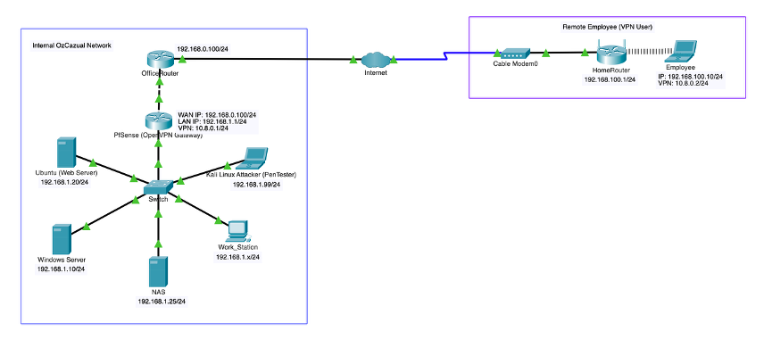

# The OzCazual Infrastructure Security Project

**Role:** Team Lead (Certificate IV in Cyber Security Capstone Project)  
**Focus Area:** Brute-Force Protection & Infrastructure Security

## Project Overview

This project simulates a real-world **infrastructure security upgrade** for _OzCazual_, a fictional local clothing company. The goal was to harden the company’s environment against common cyberattacks, with a focus on **brute-force attack protection, incident response, and network defense.**

## Objectives

- Design a **secure infrastructure topology** (Windows, Linux, pfSense, Web Server, Domain Controller).
- Simulate **brute-force attacks** (RDP, SSH, SMB, WordPress login).
- Implement **mitigation strategies** (RDP Guard, Fail2Ban, Wordfence).
- Develop **Runbooks and Playbooks** for both Red Team (attack) and Blue Team (defense).
- Document results, lessons learned, and future improvements.

## Network Topology

## Tools & Technologies

- Windows Server 2022 – Active Directory, RDP
- Ubuntu 22.04 – Nginx, PHP, WordPress, Fail2Ban
- pfSense – Firewall, routing
- Kali Linux – Attack simulation (Hydra, CrackMapExec)
- Wordfence – WordPress hardening
- Wireshark / Event Viewer – Monitoring & logging

## Attack Scenarios Simulated

- RDP brute-force attacks (Hydra → Windows Server)
- SMB brute-force attacks (CrackMapExec → Windows Server)
- SSH brute-force attacks (Hydra → Ubuntu)
- WordPress brute-force attacks (Wpscan / Hydra → WordPress site)

## Defensive Measures Implemented

- **RDPGuard** on Windows Server → blocks repeated failed login attempts.
- **Fail2Ban** on Ubuntu → bans IPs after multiple SSH/HTTP failures.
- **Wordfence** on WordPress → firewall, malware scan, brute-force prevention.
- **Account Lockout Policies** → Active Directory enforced thresholds.
- **Firewall Rules** → Restricted external access via pfSense.

## Key Results

- Brute-force attempts detected in logs (SSH, RDP, SMB, WordPress).
- Mitigations successfully blocked or delayed attacks.
- Security posture improved with layered defense.
- Documented playbooks can guide SOC teams in real incidents.

## Repository Structure

- [Docs](./Docs)
  - [Design_Diagram_and_Network_Diagram](./Docs/Design_Diagram_and_Network_Diagram.pdf) → This file represents the upgraded infrastructure design and their network
  - [Assets/](./Docs/Assets/) → This folder has the documentation of the infrastructural assets such as VMs and related software installations and configurations
  - [Playbooks/](./Docs/Playbooks/) → This folder has the documentation of Playbooks (Defences) on Brute-Force Protection of VMs
  - [Runbooks/](./Docs/Runbooks/) → This Folder has the documentation of Runbooks (Brute-Force Attacks) against the initial VM setup, for testing the defences and also has the observations
- [README.md](README.md) → Project Overview (this file)

## Documentation

- [Design Diagram and Network Topology](./Docs/Design_Diagram_and_Network_Diagram.pdf)
- [Blue Team Playbooks](./Docs/Playbooks/)
- [Red Team Runbooks](./Docs/Runbooks/)

## Lessons Learned

- Importance of layered security (no single control is enough).
- Detection is only useful if combined with response playbooks.
- Logging & monitoring (e.g., Fail2Ban, Sysmon) give visibility into attacks.
- Next step: integrate a SIEM (Wazuh / Splunk) for centralized log correlation.

## Scenario (Background)

# The OzCazual Infrastructure Security Project

**Role:** Team Lead (Certificate IV in Cyber Security Capstone Project)  
**Focus Area:** Brute-Force Protection & Infrastructure Security

## Project Overview

This project simulates a real-world **infrastructure security upgrade** for _OzCazual_, a fictional local clothing company. The goal was to harden the company’s environment against common cyberattacks, with a focus on **brute-force attack protection, incident response, and network defense.**

## Objectives

- Design a **secure infrastructure topology** (Windows, Linux, pfSense, Web Server, Domain Controller).
- Simulate **brute-force attacks** (RDP, SSH, SMB, WordPress login).
- Implement **mitigation strategies** (RDP Guard, Fail2Ban, Wordfence).
- Develop **Runbooks and Playbooks** for both Red Team (attack) and Blue Team (defense).
- Document results, lessons learned, and future improvements.

## Network Topology

## Tools & Technologies

- Windows Server 2022 – Active Directory, RDP
- Ubuntu 22.04 – Nginx, PHP, WordPress, Fail2Ban
- pfSense – Firewall, routing
- Kali Linux – Attack simulation (Hydra, CrackMapExec)
- Wordfence – WordPress hardening
- Wireshark / Event Viewer – Monitoring & logging

## Attack Scenarios Simulated

- RDP brute-force attacks (Hydra → Windows Server)
- SMB brute-force attacks (CrackMapExec → Windows Server)
- SSH brute-force attacks (Hydra → Ubuntu)
- WordPress brute-force attacks (Wpscan / Hydra → WordPress site)

## Defensive Measures Implemented

- **RDPGuard** on Windows Server → blocks repeated failed login attempts.
- **Fail2Ban** on Ubuntu → bans IPs after multiple SSH/HTTP failures.
- **Wordfence** on WordPress → firewall, malware scan, brute-force prevention.
- **Account Lockout Policies** → Active Directory enforced thresholds.
- **Firewall Rules** → Restricted external access via pfSense.

## Key Results

- Brute-force attempts detected in logs (SSH, RDP, SMB, WordPress).
- Mitigations successfully blocked or delayed attacks.
- Security posture improved with layered defense.
- Documented playbooks can guide SOC teams in real incidents.

## Repository Structure

- [Docs](./Docs)
  - [Design_Diagram_and_Network_Diagram](./Docs/Design_Diagram_and_Network_Diagram.pdf) → This file represents the upgraded infrastructure design and their network
  - [Assets/](./Docs/Assets/) → This folder has the documentation of the infrastructural assets such as VMs and related software installations and configurations
  - [Playbooks/](./Docs/Playbooks/) → This folder has the documentation of Playbooks (Defences) on Brute-Force Protection of VMs
  - [Runbooks/](./Docs/Runbooks/) → This Folder has the documentation of Runbooks (Brute-Force Attacks) against the initial VM setup, for testing the defences and also has the observations
- [README.md](README.md) → Project Overview (this file)

## Documentation

- [Design Diagram and Network Topology](./Docs/Design_Diagram_and_Network_Diagram.pdf)
- [Blue Team Playbooks](./Docs/Playbooks/)
- [Red Team Runbooks](./Docs/Runbooks/)

## Lessons Learned

- Importance of layered security (no single control is enough).
- Detection is only useful if combined with response playbooks.
- Logging & monitoring (e.g., Fail2Ban, Sysmon) give visibility into attacks.
- Next step: integrate a SIEM (Wazuh / Splunk) for centralized log correlation.

## Scenario (Background)

A local clothing company by the name of OzCazual have had a large increase in online visitors to their website over the last year and the company has also had an influx of employees working remotely. There are growing concerns that the company may face service interruptions and/or data breaches if they don’t get on top of their infrastructure and security.

Click to expand

OzCazual currently have on premises servers running their local data share for employees to share files and a webserver to run their e-commerce storefront.

Currently, remote staff are accessing the file share over the internet and the on-premises router is port-forwarding port 445 so that staff can reach the network share.

### Topology:

#### Synology NAS

This Synology NAS is being used to store and share data between staff and also holds some confidential information about the business and customers.
There are user accounts created for each staff member, no two-factor authentication has been enabled for any users.
Port 445 has been forwarded on the router to connect to the SMB share on the NAS.

#### Ubuntu 16.04 LTS

Xeon 5110/4GB Ram
Powers the webserver which runs: Apache 2.2, PHP 7.2, MySQL 5.5, WordPress 5.4.

#### Windows Server 2012

Used for active directory so that staff can login to computers.
Port forwarding has been setup to allow working from home staff to also login.

### Objective:

OzCazual would like you and your team to upgrade their infrastructure and network topology to be more secure and safely transport information to the remote staff.

You are required to build the infrastructure in a virtual environment such as VirtualBox, VMware, or even a cloud solution such as Azure or AWS.

At a minimum, you must implement the following machines.

- Windows Server
- Linux Web Server

At a minimum, you must implement the following forms of protection

- IDS/IPS/
- Brute-force Protection
- 2FA/MFA
- Virus/malware Protection
- Firewall/Denial of Service protection

## Future Improvements

- Add SIEM (Wazuh / ELK) for central log collection & alerting.
- Expand brute-force testing to cloud-hosted environments.
- Automate playbook execution using SOAR-style scripts.
- Test phishing and DoS attack scenarios.

## Author

**Anusha Ramu Chakravarthi**

- Certificate IV in Cyber Security (Victoria University, 2025)
- Actively pursuing **ISC2 CC** & **CompTIA Security+**
- Interested in SOC Analyst, Blue Team, and GRC roles
